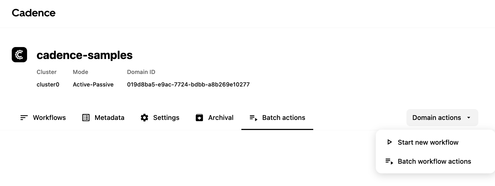
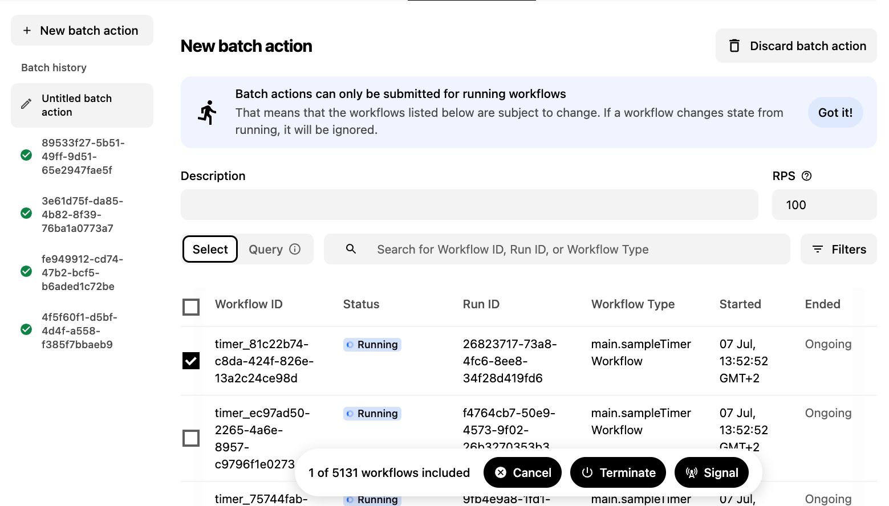
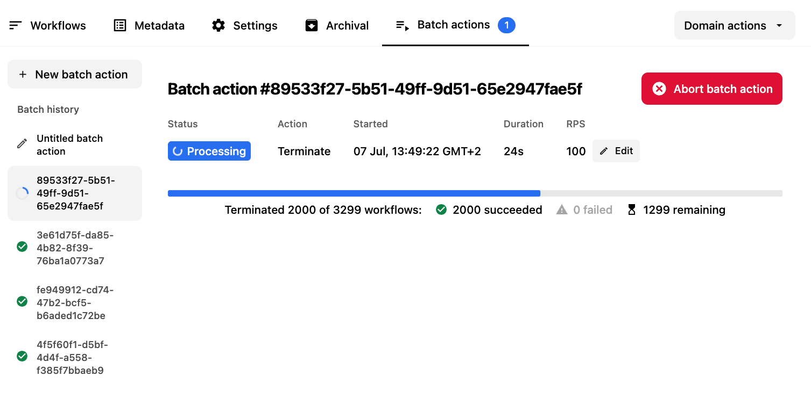

What happens when a bad deploy sends thousands of workflows into a broken state? Or when you need to signal an entire cohort of workflows to advance past a checkpoint?

With **Batch Actions**, Cadence Web lets you select a group of workflows and act on all of them at once, right from the browser.

<!-- truncate -->

## What Is a Batch Action?

A Batch Action is a cadence system workflow, able to act on multiple workflow executions simultaneously. Instead of acting on one workflow at a time, you define a **target set**—a search query that matches workflows by status, type, domain, or any combination—and then dispatch a single action that Cadence fans out across all matching executions.

Under the hood, Cadence's batch processing system handles the fan-out reliably and at scale. From the Web UI's perspective, you describe *what* to act on and *which action*, and Cadence takes care of the rest.

**Supported actions:**

| Action | What It Does |
|--------|--------------|
| **Terminate** | Immediately stops all matching workflow executions |
| **Signal** | Sends a named signal (with optional payload) to all matching workflows |
| **Cancel** | Requests graceful cancellation of all matching workflows |

This is especially powerful in incident response, where time matters and scale makes one-at-a-time tooling impractical.

Batch Actions have been available through the [Cadence CLI](https://cadenceworkflow.io/docs/cli#signal-cancel-terminate-workflows-as-a-batch-job) for a while. This UI brings the same power to the browser, with visual targeting, live progress tracking, and no terminal required.

## How It Works

### Before You Start

Batch Actions require two things to be in place:

1. **Advanced Visibility** must be enabled on your [Cadence server](https://cadenceworkflow.io/docs/codelabs/workflow-tests-go-replayer-shadower#1-start-the-cadence-server-with-advanced-visibility).
2. **The feature flag must be enabled** in Cadence Web. See the [Feature Flags section](https://github.com/cadence-workflow/cadence-web#feature-flags) in the Cadence Web README for instructions.

### Opening the Batch Actions Tab

Batch Actions live in their own **tab on the Domain page**. You can open it two ways:

- Navigate directly to the **Batch Actions tab** on the Domain page
- Use the **Domain Actions dropdown** in the top-right corner to create a new batch action, which opens the tab automatically

### Creating a Draft

Every batch action starts as a **draft**. This gives you the chance to define and review the target set before anything is applied to your workflows.

You have two ways to select the target workflows:

- **Query** — write a search query that matches workflows by status, type, start time, or any custom search attributes. Cadence evaluates the query at execution time.
- **Manual selection** — browse the workflow list with search filters and use **checkboxes** to pick individual executions.

Once the target set is defined,fill in any required parameters (signal name and payload for signals), choose the action (Terminate, Signal, or Cancel), and optionally set the **RPS** (workflows processed per second) to control the rollout rate.

### Deep Linking

Drafts are shareable. The tab supports **deep linking**, so you can copy the URL of a draft and send it to a teammate for review before submitting, or link directly to a specific batch action's details page.

### Tracking Progress

Submitted batch actions appear in the **sidebar** of the Batch Actions tab as an action history. Click any entry to open its details:

- Total workflows matched
- How many have been succeeded or failed so far.

For running actions, you are able to change the **RPS** param mid-flight. This is useful for very large batches that seem to progress too slowly. 

## Try It Today!

Batch Actions close the gap between observing a problem and fixing it at scale. Whether you're recovering from an incident, migrating workflows, or just cleaning up old executions, everything you need is now in one place.

Upgrade to the latest **Cadence Web** release and give it a try. We'd love to hear what workflows you're managing at scale.

- **Ask a question** — [#cadence on CNCF Slack](https://communityinviter.com/apps/cloud-native/cncf)
- **Open an issue** — [cadence-web on GitHub](https://github.com/cadence-workflow/cadence-web/issues)
- **Join the discussion** — [GitHub Discussions](https://github.com/cadence-workflow/cadence/discussions)
